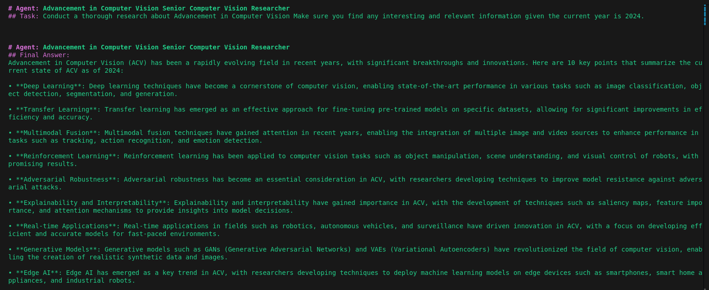
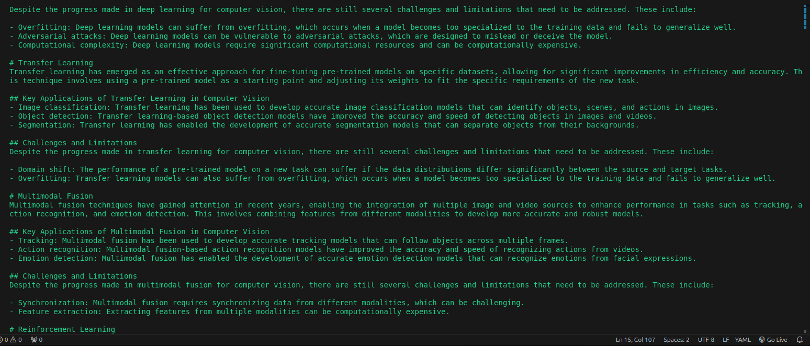
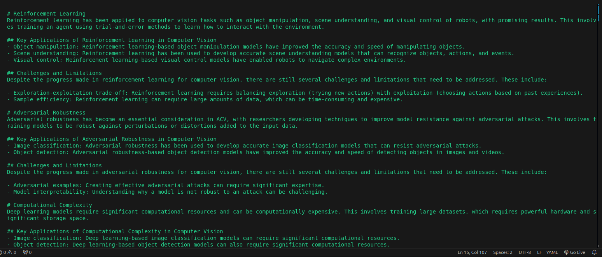
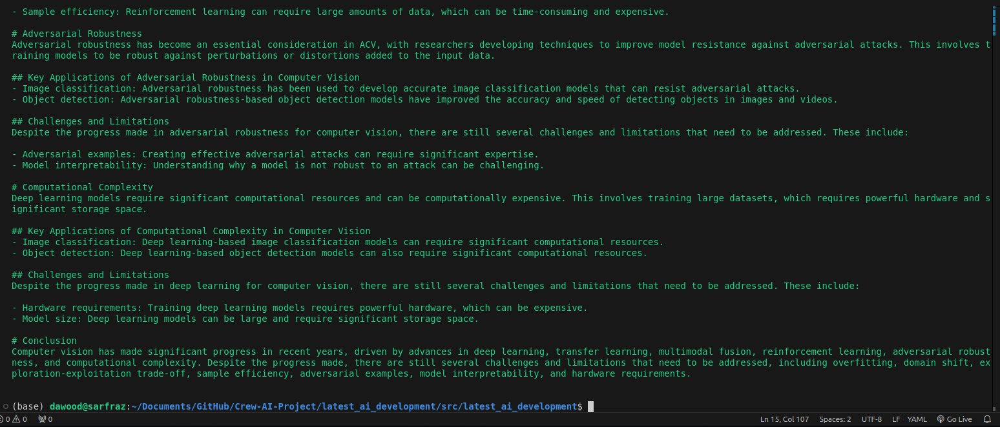

# Intellicrew - Intelligent Agent Workflow System

## Introduction

Intellicrew is a framework for building AI agent teams that collaborate to complete complex tasks. Using specialized agents such as **Researcher** and **Reporting Analyst**, Intellicrew enhances workflow efficiency and delivers comprehensive, actionable results. The system utilizes **Llama 3.2** locally and **Ollama** to power the AI agents' capabilities, enabling seamless communication and task execution.

## Agents in Intellicrew

In Intellicrew, agents are specialized entities that perform distinct tasks autonomously. Each agent is optimized for a particular role within a given workflow, contributing to the overall efficiency of the system. The agents are designed to interact with each other, ensuring that tasks are executed collaboratively.

### Researcher Agent
- **Role:** Senior Computer Vision Researcher
- **Goal:** Uncover cutting-edge developments in computer vision.
- **Backstory:** You're a seasoned researcher with a knack for uncovering the latest developments in computer vision. Known for your ability to find the most relevant information and present it in a clear and concise manner.

#### Research Task
- **Description:** Conduct thorough research on current developments in computer vision. Ensure that the research is up-to-date and relevant to 2024.
- **Expected Output:** A list of 10 bullet points with the most relevant and current findings in the field of computer vision.

### Reporting Analyst Agent
- **Role:** Reporting Analyst (focused on computer vision research)
- **Goal:** Create detailed reports based on research findings and data analysis.
- **Backstory:** You're a meticulous analyst with a keen eye for detail. Known for turning complex data into clear and concise reports, making it easy for others to understand and act on the information provided.

#### Reporting Task
- **Description:** Review the research findings and expand each topic into a comprehensive, well-structured report. Ensure that the report is detailed, contains relevant information, and is easy to understand.
- **Expected Output:** A fully-fledged report in markdown format, with each main topic expanded into a detailed section.

## Task Workflow

In Intellicrew, tasks are divided between agents to achieve collaborative outcomes:

1. **Research Task:** Handled by the Researcher agent, which gathers and summarizes the most relevant findings about the topic.
2. **Reporting Task:** Handled by the Reporting Analyst agent, which takes the research findings and expands them into a detailed, well-organized report.

The **Researcher Agent** autonomously searches for the latest papers, trends, and findings in the given field, while the **Reporting Analyst Agent** reviews and structures these findings into a clear, actionable report.

## Technology Stack

- **Llama 3.2** (Local): Used for processing and generating natural language responses.
- **Ollama:** A platform for deploying and managing models like Llama.
- **Python:** The main programming language used to implement the system.
- **OpenAI API** (optional): Can be used for enhanced processing, though Llama 3.2 is the primary model.
- **Markdown:** Used for generating report outputs in a structured and readable format.

## Example Workflow

### Research Task Example:
- **Agent:** Researcher
- **Description:** The researcher agent is tasked with uncovering the latest trends and innovations in **Computer Vision** (topic can be adjusted to the desired field). It autonomously searches academic papers, news sources, and other relevant databases for up-to-date information.
- **Expected Output:** 
    - A list of 10 bullet points summarizing the most relevant advancements or findings in **Computer Vision**.

### Reporting Task Example:
- **Agent:** Reporting Analyst
- **Description:** After the Researcher agent completes the research task, the Reporting Analyst agent takes the findings and creates a detailed report.
- **Expected Output:**
    - A fully structured markdown report detailing the findings, with each bullet point from the research task expanded into comprehensive sections with supporting information.

## Setup Instructions

### How to Set Up and Run the Project:

1. **Clone Repo from GitHub:**  
   Clone Intellicrew from GitHub: [https://github.com/Daudsarfraz/Intellicrew](https://github.com/Daudsarfraz/Intellicrew)

2. **Download Ollama:**  
   Download Ollama from: [https://ollama.com/download](https://ollama.com/download)

3. **Install Llama 3.2:**  
   After installing Ollama, run the model with:  
   ```bash
   ollama run llama3.2

## Demo

Here is a quick demonstration of how Intellicrew works:

### Step 1: Initial Setup


### Step 2: Researcher Agent at Work


### Step 3: Reporting Analyst Agent Processing


### Step 4: Collaboration Between Agents


### Step 5: Final Report Generation


